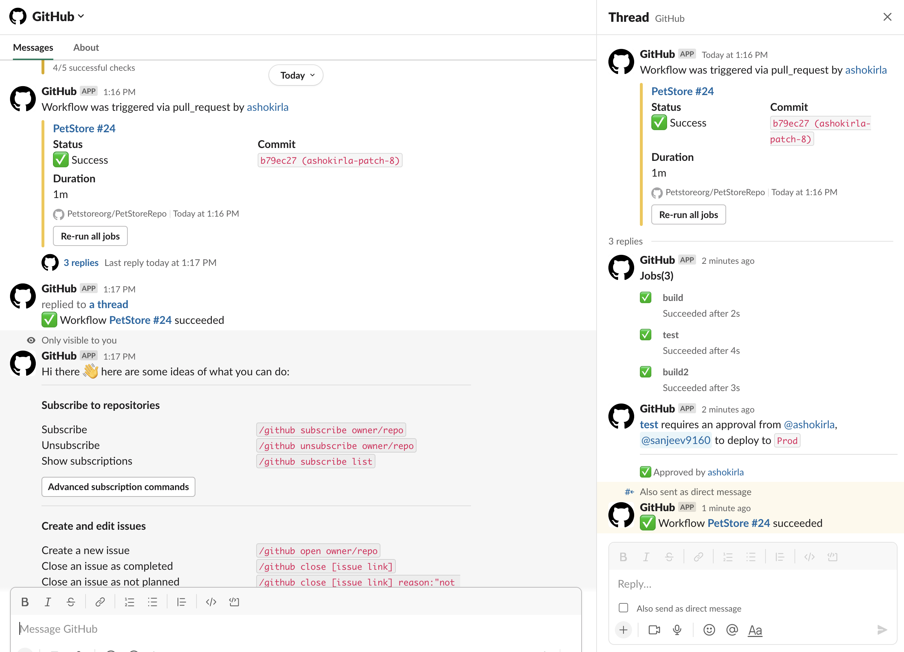
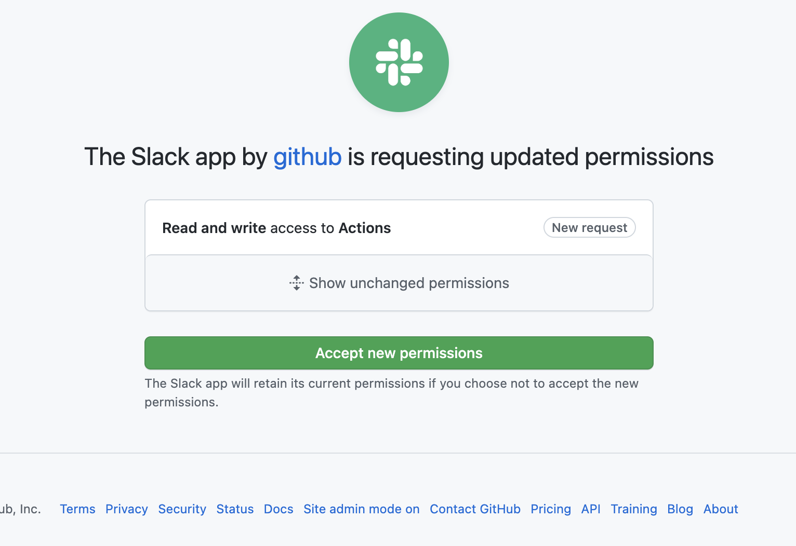
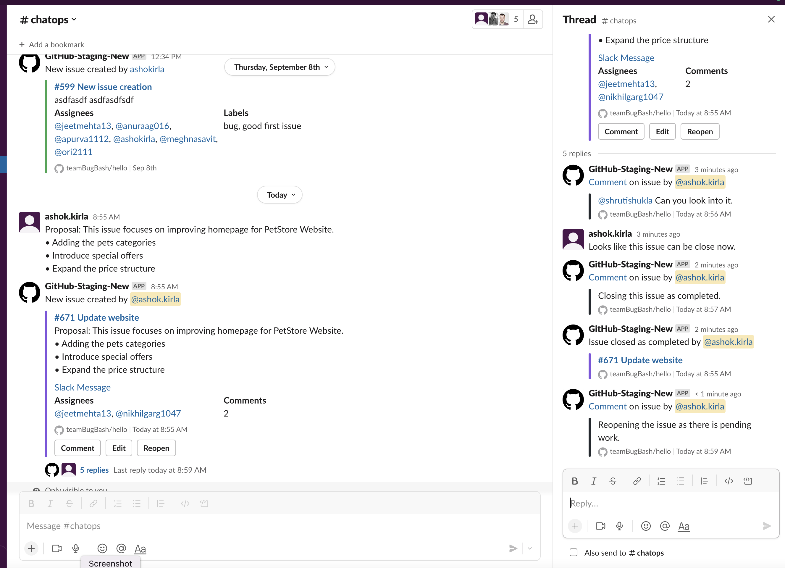
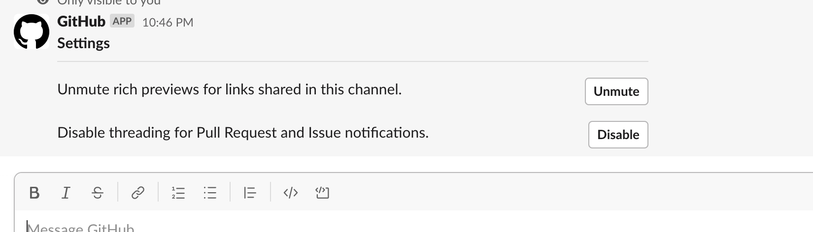
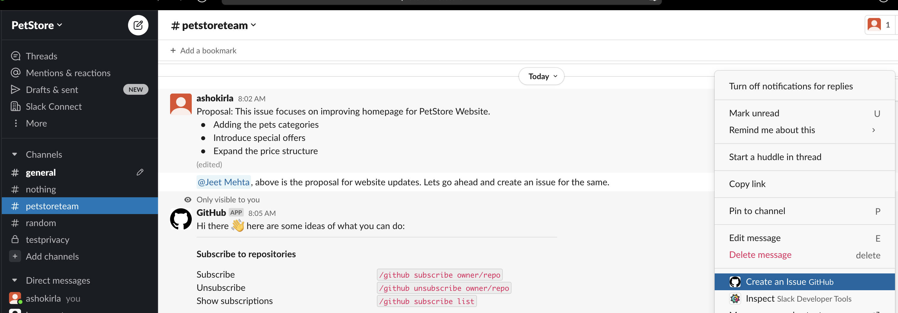
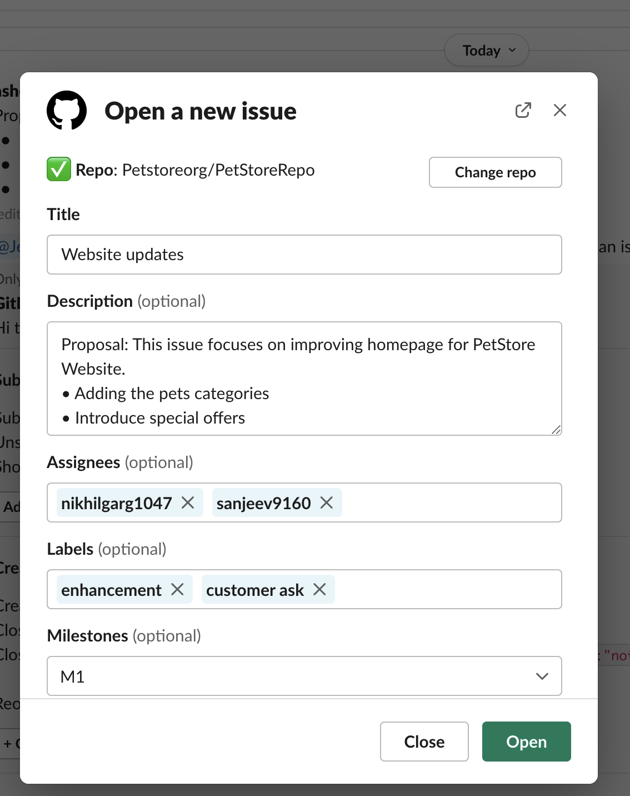
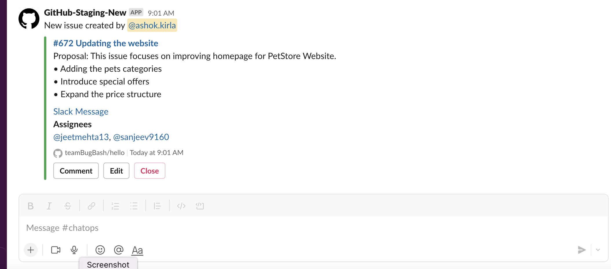
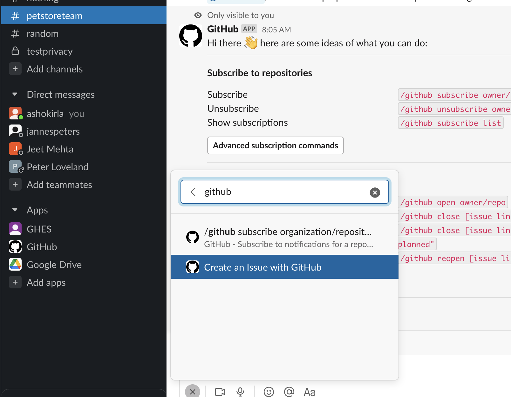
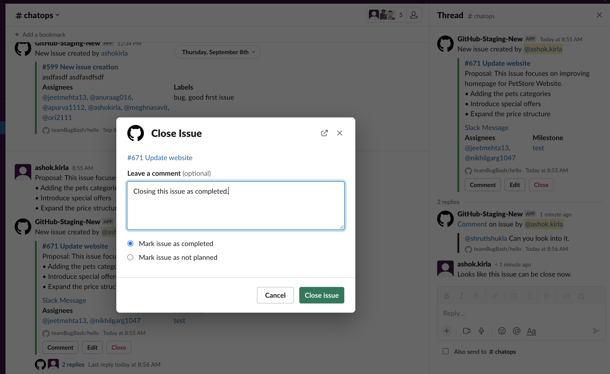

# GitHub + Slack Integration
## About

The GitHub integration for Slack gives you and your teams full visibility into your GitHub projects right in Slack channels, where you can generate ideas, triage issues and collaborate with other teams to move projects forward. This integration is an open source project, built and maintained by GitHub.

## Table of Contents
- [Installing the GitHub integration for Slack](#installing-the-github-integration-for-slack)
  - [Requirements](#requirements)
  - [Installation](#installation)
- [Getting Started](#getting-started)
  - [Subscribing and Unsubscribing](#subscribing-and-unsubscribing)
  - [Authorization](#authorization)
- [Features](#features)
  - [Subscribe to an Organization or a Repository](#subscribe-to-an-organization-or-a-repository)
  - [Customize your notifications](#customize-your-notifications)
  - [Actions workflow notifications](#actions-workflow-notifications)
  - [Deployments notifications](#deployment-notifications)
  - [Mentions](#mentions)
  - [Threading](#threading)
  - [Take action](#take-action)
  - [Link previews](#link-previews)
  - [Scheduled Reminders](#scheduled-reminders)
  - [Enterprise Grid](#enterprise-grid)
- [GHES Integration](#ghes-integration)
- [Need help?](#questions-need-help)
- [License](#license)
--------
## Installing the GitHub integration for Slack
### Requirements
#### GHEC - GA
This app officially supports GitHub.com (which includes our GitHub Enterprise cloud-hosted offering) and Slack.com. 

#### GHES - GA
GHES integration with Slack.com is now GA with GHES 3.8. 
The detailed steps for integrating Slack with GHES can be found [here](#ghes-integration). 

### Installation
[Install the GitHub integration for Slack](https://slack.com/apps/A01BP7R4KNY-github). After you've signed in to your Slack workspace, you will be prompted to give the app access:

<p align="center"></p>

After the app is installed, and once you've added the GitHub integration to the relevant channels using `/invite @github`, you will see previews of links to GitHub issues, pull-requests, and code rendered as rich text in your workspace.

<p align="center"></p>

## Getting Started
Once you install the app, you can now interact with GitHub app as a Personal app or access from a channel. Once the app is installed in the workspace, the GitHub app is enabled in all the public channels. For private channels, you need to explicitly invite `/invite @github`

At this point, your Slack and GitHub user accounts are now linked. You will be prompted to connect to GitHub. This is a primary step required to access the app. Alternatively, we can also connect by running `/github signin`.

<p align="center"></p>

And once you connect, you will see the next steps and list of functionalities available for you. 
<p align="center"></p>


### Subscribing and Unsubscribing

The `/github` slash command also accepts a `subscribe` argument that you can use to subscribe to an Organization or Repository's activity `/github subscribe <organization>/<repository>`.

<p align="center"></p>

If you originally gave the app access to "All repositories" and you've created a new private repository on GitHub after installing the GitHub integration for Slack, the `/github subscribe` command will work automatically on your new repository. If you installed the app on a subset of repositories, the app will prompt you to install it on the new repository.

The `/github` slash command also supports `unsubscribe`. To unsubscribe to notifications from a repository, use `/github unsubscribe <organization>/<repository>`

### Authorization
By granting the app access, you are providing the following authorizations to your GitHub and Slack accounts:

#### Slack Permission Scopes

|Permission scope|Why we need it|
|---|---|
|Access private conversations between you and the App | To message you with instructions.  |
|View links to GitHub.com in messages| To render rich links from `github.com`|
|Add link previews to GitHub.com to messages| To render rich links to `github.com`|
|Add slash commands| To add the `/github` slash command to your Slack workspace |
|View the workspace or organization's name, email domain, and icon| To store subscriptions you set up|
|Post messages as the app| To notify you of activity that happens on GitHub, in Slack|

#### GitHub Permission Scopes

|Permission scope|Why we need it|
|---|---|
|Read access to code| To render code snippets in Slack|
|Read access to actions, commit statuses, checks, discussions, issues, metadata, pull requests, and repository projects | To render previews of links shared in Slack|
|Write access to actions, issues, deployments, and pull requests | To take action from Slack with the `/github` command and directly from messages|

## Features

### Subscribe to an Organization or a Repository
On repositories, the app notifies of `open`, `close`, and `re-open` events on pull requests and issues in repositories you've subscribed to. It also notifies of any `push` directly to the repository's default branch as well as `comments` on issues and pull requests.

### Customize your notifications

You can customize your notifications by subscribing to activity that is relevant to your Slack channel, and unsubscribing from activity that is less helpful to your project.

Settings are configured with the `/github` slash command:

```
/github subscribe owner/repo [feature]
/github unsubscribe owner/repo [feature]
```

These are enabled by default, and can be disabled with the `/github unsubscribe owner/repo [feature]` command:

- `issues` - Opened or closed issues
- `pulls` - New or merged pull requests, as well as draft pull requests marked "Ready for Review"
- `commits` - New commits on the default branch (usually `main`)
- `releases` - Published releases
- `deployments` - Deployment status updates.

These are disabled by default, and can be enabled with the `/github subscribe owner/repo [feature]` command:

- `workflows` - Actions workflow run notifications
- `reviews` - Pull request reviews
- `comments` - New comments on issues and pull requests
- `branches` - Created or deleted branches
- `commits:*` - All commits pushed to any branch
- `+label:"your label"` - Filter issues, pull-requests and comments based on their labels.
- `discussions` - Discussions created or answered

You can subscribe or unsubscribe from multiple settings at once. For example, to turn on activity for pull request reviews and comments:

```
/github subscribe owner/repo reviews comments
```

And to turn it back off:

```
/github unsubscribe owner/repo reviews comments
```

#### Branch filters for commit
Branch filters allow filtering commit notifications. By default when you subscribe for commits feature, you will get notifications for your default branch (i.e. main). However, you can choose to filter on a specific branch, or a pattern of branches or all branches.

- `/github subscribe org/repo commits`  for commit notifications from a default branch.
- `/github subscribe org/repo commits:*`  for commit notifications across all the branches.
- `/github subscribe org/repo commits:myBranch`  for commit notifications from a specific branch.
- `/github subscribe org/repo commits:users/*`  for commit notifications from a pattern of branches.

You can unsubscribe commits feature using `@github unsubscribe org/repo commits.

*Note*: Previously, you might have used `commits:all` to represent all branches. 'all' is no longer a reserved keyword. Going forward, you need to use '*' to represent all branches. If you have already configured with 'commits:all' previosly, dont worry, it will continue to work until you update the commits configuration.


#### Label filters for prs and issues
Label filters allow filtering incoming events based on a allowed list of **required** labels.

This is an overview of the event types that are affected by the required-label filter.

| Event                  | Is filtered       |
| ---------------------- | ----------------- |
| Pull                   | ✅ Yes             |
| Comment (PR and Issue) | ✅ Yes             |
| Issue                  | ✅ Yes             |
| Review                 | ✅ Yes             |
| Commit/Push            | ❌ No              |
| Branch                 | ❌ No              |

##### Creating a filter

Create a filter with:
```
/github subscribe owner/repo +label:priority:HIGH
```

This creates a required-label filter with the value `priority:HIGH`.
Incoming events that support filters are discarded unless they have that label.

##### Updating a filter

To update the existing filter just enter a new one, the old one will be updated.
Currently, we only support having one filter. Multiple filters might be supported in the future.

```
/github subscribe owner/repo +label:"teams/designers"
```

Now the existing filter `priority:HIGH` has been replaced by `teams/designers`.

##### Removing filters

Removing a filter is available via `unsubscribe`
```
/github unsubscribe owner/repo +label:teams/designers
```

This removes the `teams/designers` filter.

##### Listing filters

To see the currently active filters use
```
/github subscribe list features
```

##### Valid filters

It is common to have certain special characters in labels. Therefore we added support for the most common special characters
for label filters. Here a few examples:

* `label:priority:HIGH`
* `label:teams/designers`
* `label:"DO NOT MERGE"`
* `label:"very important"`
* `label:":construction: WIP"`

Most labels will work seamlessly, this includes all emojis that slack and github provide out of the box.
However in the following rare circumstances you might run into difficulties:

* Multibyte characters that are not encoded as `:foo:`
* `,` is reserved

### Actions workflow notifications
You can subscribe to GitHub Actions workflow run notifications from your channel or personal app using "workflows" feature.

<p align="left"></p>

- You will get notified when a new workflow run is triggered. And you can track the live status of the jobs. 
- You can track the approval notifications as a reply in the thread and you can approve the notifications directly from channel/personal app.
- Once the workflow is completed, you will get a update as a reply in th thread so that you can complete context and history about the workflow run.
- If something fails, you can choose to rerun the workflow in place and you can also enable debug logs if needed.

#### Workflow notification filters
Getting notified about each and every workflow run notification can be noisy. So, we are providing you capability to filter the notifications based on your requirement.
You can filter your actions workflows notifications based on name, event, actor and/or branch. You can filter the notifications as below.

`/github subscribe owner/repo workflows:{name:"your workflow name" event:"workflow event" branch:"branch name" actor:"actor name"}`

- **name**: Name of your workflow
- **event**: The event on which the workflow is triggered. You can find all the available events list [here](https://docs.github.com/en/actions/using-workflows/events-that-trigger-workflows#available-events).
- **actor**: The person who triggered or responsible for running of the workflow
- **branch**: The branch on which the workflow is running. Only incase where pull_request event is included, the branch will be the target branch the pull request is created for.

You can pass multiple entries for each of the events in as a comma separate list as below example:
`/github subscribe org/repo workflows:{event:"pull_request","push" branch:"main","dev" actor:"ashokirla"}`

By default, when you configure workflow notifications without passing any filters, it is configured for workflows triggered via pull requests targeting your default branch.
You can pass one or multiple entries. 

You can unsubscribe for workflows notifications by just running the below command:
`/github unsubscribe org/repo workflows`

#### Updates to the app permissions
To receive the above notifications you need to grant access to receive Actions events by GitHub app in Slack. You will be prompted to do so as you try to subscribe for `workflows` feature for your organization the first time.

<p align="left"></p>

### Deployment notifications

We support a separate notifications for your deployments. These deployments can happen from Actions or from external sources using [Deployments api](https://docs.github.com/en/rest/deployments/deployments?apiVersion=2022-11-28#about-the-deployments-api). 

<p align="left"></p>

You can enable/disable this feature by running:

`/github subscribe/unsubscribe org/repo deployments`

Note: If you are using GitHub actions and want to track your deployments to environments, we recommend to use the new `workflows` feature instead as it shows the full picture and gives you ability to approve your deployments inplace.


### Mentions
When you subscribe to a repository in Slack, you will now see yourself mentioned in the notifications where you are referred and needs your attention.
<p align="left"></p>
<p align="left"></p>

When you receive notifications for Issues, PRs and Deployments, here are the cases when you will be mentioned.
- Assignee in an Issue
- Reviewer for a PR
- Mentioned in a PR/Issue description/comment/discussion
- Reviewer for a Deployment
- Scheduled reminders for PR review requests

And the best part is - you can now see the summary of GitHub notifications where you are mentioned as part of 'Mentions & reactions' section in Slack.
<p align="left"></p>

#### How do mentions work?
Mentions will work only if you login to GitHub app in your Slack workspace (using the `/github signin` slash command). When you login to GitHub app with your GitHub id, we map it with your Slack id and ping you in Slack whenever you are mentioned in any of the GitHub notifications.  

**Note**: If you have multiple Slack workspaces where you use GitHub app, mentions will work only in the workspace where you logged in to GitHub app most recently.

### Threading
Notifications for any Issues and PRs are grouped under a parent card as replies. The parent card always shows the latest status of the Issue/PR along with other meta-data like title, description, assignees, reviewers, labels and checks. Threading gives context and helps improve collaboration in the channel.

<p align="left"></p>

This will reduce the noise in the channel. And our mentions feature ensures that only those involved in the conversation thread are notified. Only the parent card is posted to the channel and rest of the notifications will be added as a reply in the thread. However, the state change activities like close/reopen issue are added to the thread as reply and also posted to the channel as this might be of interest to the group. 


#### Broadcast comments and reviews to channel
If you have subscribed for comments and reviews notifications, and you also want the channel members to see them instead of just those who are participants of the issue, you can opt-in for the same by running 

`/github subscribe org/repo comments:"channel"` and 

`/github subscribe org/repo reviews:"channel"`

Note: By default comments and reviews will only showup into the thread. And you need to explicitly run the above command to ensure the comments also start flowing into channel as well.

#### Mentions in the Slack Threads
If you are a participant in an issue/pr i.e. mentioned in the comment or added as an assignee/reviewer, our mentions feature ensures you are notified in the threads section in Slack. You need not go to the channel for the issues/prs that need your attention. You can focus on the ones where you are needed and our threading feature ensures you get the full picture and you can directly take action from there. This is a very powerful feature which ensures, you dont miss out on any issues/prs that need your attention.

However, if you absolutely believe that you dont need to see issues/PR updates in threads and think it is a noise, we can suggest a quick workaround for no more pings or entries into your threads. Our GitHub app only mentions you in the Slack workspace where you logged into GitHub the latest. You can go to a least used Slack workspace or personal Slack workspace and log into GitHub with our GitHub app from there. Then you will not be pinged or see updates in threads in the other main workspace.

#### Don't want threading?
If you don't want threading functionality or not yet ready to adapt to new model, we want to give you the flexibility. You can disable/enable threading for Issues and Pull requests noitifications in your channel. You can go to the channel where you don't need threading and run the following command.
`/github settings`

You will see an option to Disable/Enable threading for that channel. Any member who is part of the channel will be able to perform this action.

<p align="left"></p>


### Take action
Slack conversations often lead to decisions and actionable takeaways. Now it’s easier to start on next steps from Slack.

You no longer have to switch or redirect to GitHub to perform any actions on issues. You can truly create and manage issues from where you collaborate i.e. Slack.

#### Issue creation experience
You can now create issue by just a click, right from the place where you collaborate. In any channel/personal app/group or direct chat, you can now click on the three dots (...) at the top right corner of a message and choose 'Create an Issue GitHub' from the list. This will launch a create issue dialogue.

<p align="left"></p>
<p align="left"></p>

1. The content of the message from which you have triggered this create issue flow will be filled into the description helping you get started on the issue. Also the link of the Slack conversation will be added to description in the end automatically giving you reference when you want to track the issue later. You can also edit the entire description if you want.
2. The last used repo in the channel will be automatically filled in. However, you can go ahead and change to the repo of your choice.
3. You can optionally fill in labels, assignees and milestones when you create an issue.
4. Once the issue is created you will receive a confirmation card in the channel from where you have initiated the issue creation flow.

<p align="left"></p>

Alternatively, you can create an issue from Slack in two other ways.
1. Global shortcut: We have introduced a new Global shortcut to create issue from the channel.
2. CLI command: You can also launch create issue flow by running a command `/github open` from the chat box.
<p align="left"></p>

Note: You need to be signed in and have necessary access to the repo to perform any actions. 

##### Issue manage experience
You can also manage the lifecycle of the issue directly from the chat. When you subscribe to a repo and get an issue notification or when you create a new issue from Slack, you will now see a issue card with Call-to-Action buttons comment, edit, close/reopen. You can perform these actions directly from chat. 

<p align="left"></p>

Note: When you perform an action on the issue card from Slack, the response is added as a reply to the thread even if you didn't subscribe to that activity through subscriptions. However, if you subscribe, you will also get notifications for activities that happen outside Slack as well.

### Link previews
<!-- preserve old anchor in case other docs link there -->
<a name="types-of-public-link-unfurls"></a>

When a user posts a GitHub link to **issues and pull requests**, directly linked **comments**, code **blobs** with line numbers, as well as **organizations, repositories, and users** in Slack, a preview of the link will be shown.

Previews of links will not be shown if:

- link previews for `github.com` have been [disabled for your workspace](https://get.slack.help/hc/en-us/articles/204399343-Share-links-in-Slack#turn-off-link-previews-for-specific-sites)
- the same link was already shared in the last 30 minutes in the same channel
- 3 or more links are shared in the same chat message
- The repository is private and the user that shared the link:
  - has not signed in to their GitHub account
  - asked not to show a preview when prompted
  - the GitHub app is not in the channel, which you can remedy with `/invite @github`


### Scheduled reminders
Scheduled reminders are used to make sure that users focus on the most important review requests that require their attention. Scheduled reminders for pull requests will send a message to you in Slack with open pull requests needing your review at a specified time. For example, you can setup scheduled reminders to send you a message in Slack every morning at 10 AM with pull requests needing to be reviewed by you or one of your teams.

You can configure scheduled reminders for you (personal reminders), your team and for your organization. 

#### Personal scheduled reminders
Personal scheduled reminders are configured as part of your GitHub personal app in Slack. You can set scheduled reminders for personal or team-level review requests for pull requests in organizations you are a member of. As part of personal reminders, you can also configure real time alerts for your pull requests. You can find more details [here](https://docs.github.com/en/account-and-profile/setting-up-and-managing-your-github-user-account/managing-your-membership-in-organizations/managing-your-scheduled-reminders).

#### Channel level scheduled reminders
You can configure scheduled reminders for pending pull requests as part of your Slack channels so that your team can stay on top of your work. For a given Slack channel, you can configure scheduled reminders for your organization or your team. For more details about configuring scheduled reminders, you should visit, [organization level reminders](https://docs.github.com/en/organizations/managing-organization-settings/managing-scheduled-reminders-for-your-organization) and [team level reminders](https://docs.github.com/en/organizations/organizing-members-into-teams/managing-scheduled-reminders-for-your-team). 

### Enterprise Grid
If you are on Slack Enterprise Grid and have multiple Slack workspaces in your organization where you need to use GitHub, you can install and manage your GitHub app on Slack Enterprise Grid. Org owners and Org admins in Slack Enterprise grid can:

1. Install the GitHub app at the org level and choose which workspaces you want to add/remove the GitHub app
<p align="left"></p>

2. Manage GitHub app installations requests from your workspace members.

3. Make GitHub app available in all future workspaces by default.
<p align="left"></p>

#### Few things to note
- Only Enterprise grid org admins and org owners will be able to install and manage the GitHub app at the grid level. 

- You can install the GitHub app at orglevel by clicking [here](www.slack.github.com) and selecting the enterprise grid organization to install. 
<p align="left"></p>

- If you have already installed GitHub app in one of the workspaces in the grid, you can now install the app at org level and manage it across the workspaces by going to your enterprise grid management console -> installed apps.
<p align="left"></p>

## GHES Integration
We are announcing GA for GHES integration with Slack with GHES 3.8. 

With this integration, you will now be able to subscribe to your repositories in your GHES instance and get live updates about your Issues, PRs, Commits and Deployments in Slack. And you can also take actions like commenting, open/close issues and approve your deployments directly from Slack. 

### How does this integration work?
Starting with GHES 3.8, we are shipping a dedicated ChatOps service bundled along with your GHES server. And you can choose to integrate with your Slack workspace. With our integration for GHES, you will have
1. A fully secure and scalable experience:
All your subscriptions info and any other metadata stays within your GHES setup. So, you don't have to worry about data flowing to any external service.

2. Bidirectional connectivity between GHES and Slack:
Our GHES integration is not just a notification service. It will also enable you to perform actions directly from chat. So, the only prerequisite you need to ensure your GHES instance is accessible from Slack. With Socket mode enabled, only inbound access from Slack is required.

### Configuration steps
The existing GitHub app you see in the app store can only be used for GHEC (hosted GitHub) integration. To integrate your GHES instance with Slack, you need to configure a private GHES app. Here are the steps to integrate with GHES.

1. Navigate to "your-ghes-instance:8443" and go to section “Chat Integration”
2. Select the checkbox Enable GitHub Chat Integration
  
  

3. Select Slack tab
  
  

4. Navigate to the Slack API page using the link shown below.
5. Generate a Configuration token by clicking the Generate token and select the workspace where the app will be created.
  
  

6. Paste the token back in the settings page and click generate app.
  
  

7. Once the app is generated Click on Save settings to apply to the instance
  
  

8. Once the settings are applied navigate to either `<instancename>/_slack/` or `slack.<instancename>` to install the app on your workspace.
9. If the app needs to be installed across multiple workspaces Navigate to your app by click on the app ID
10. Navigate to the “Manage Distribution” and check the “Remove hard coded Information” and Click “Activate Public Distribution”
  
  

  
### Slack Socket mode
Proxies not currently supported.

## Questions? Need help?
If you have any questions or concerns, please reach out to us by logging an issue [here](https://github.com/integrations/slack/issues/new/choose). Or please fill out GitHub's [Support form](https://github.com/contact?form%5Bsubject%5D=Re:+GitHub%2BSlack+Integration) and your request will be routed to the right team at GitHub.

| :warning: IMPORTANT          |
|:---------------------------|
| This repository is not accepting any code contributions. The current code which is running for GitHub and Slack integration has significantly diverged from the code present in this repository as it contains specific code which is required to run service in GitHub infrastructure and which can not be open sourced at this point of time. **We will continue to use issues in this repository to get feedback from customers**.|


## License
The project is available as open source under the terms of the [MIT License](LICENSE).

When using the GitHub logos, be sure to follow the [GitHub logo guidelines](https://github.com/logos).
