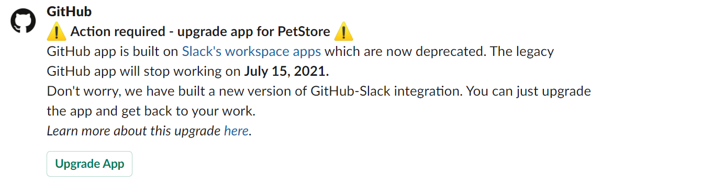
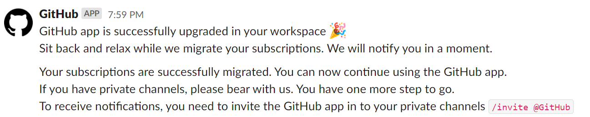

# GitHub + Slack Integration

| :warning: IMPORTANT          |
|:---------------------------|
| This repository is not accepting any code contributions. The current code which is running for GitHub and Slack integration has significantly diverged from the code present in this repository as it contains specific code which is required to run service in GitHub infrastructure and which can not be open sourced at this point of time. **We will continue to use issues in this repository to get feedback from customers**.|

> **Heads Up!** The GitHub and Slack app has a few new features to help you turn conversations into next steps. Take action on pull requests, issues, and more right from your Slack channels to start moving work forward, faster. [Read more about it on the GitHub blog](https://blog.github.com/2018-05-17-new-improvements-to-slack-and-github-integration/).

## About

The GitHub integration for Slack gives you and your teams full visibility into your GitHub projects right in Slack channels, where you can generate ideas, triage issues and collaborate with other teams to move projects forward. This integration is an open source project, built and maintained by GitHub.

## Table of Contents
- [Installing the GitHub integration for Slack](#installing-the-github-integration-for-slack)
  - [Requirements](#requirements)
  - [Installation](#installation)
  - [Subscribing and Unsubscribing](#subscribing-and-unsubscribing)
  - [Authorization](#authorization)
- Getting Started
  - [Receiving realtime notifications](#receiving-realtime-notifications)
  - [Repository Activity](#repository-activity)
  - [Link previews](#link-previews)
  - [Take action](#take-action)
  - [Configuration](#configuration)
  - [Moving away from the legacy workspace app model in Slack](#moving-away-from-the-legacy-workspace-app-model-in-slack)
- [Need help?](#questions-need-help)
- [Contributing](#contributing)
- [License](#license)
--------
## Installing the GitHub integration for Slack
### Requirements
This app officially supports GitHub.com (which includes our GitHub Enterprise cloud-hosted offering) and Slack.com, but the team plans to support GitHub Enterprise Server (our self-hosted product) in the future.

### Installation
[Install the GitHub integration for Slack](https://slack.com/apps/A01BP7R4KNY-github). After you've signed in to your Slack workspace, you will be prompted to give the app access:

<p align="center"></p>

After the app is installed, and once you've added the GitHub integration to the relevant channels using `/invite @github`, you will see previews of links to GitHub issues, pull-requests, and code rendered as rich text in your workspace.

<p align="center"></p>

### Subscribing and Unsubscribing

At this point, your Slack and GitHub user accounts are not linked. To link the two accounts, authenticate to GitHub using a `/github` slash command, `/github signin`.

The `/github` slash command also accepts a `subscribe` argument that you can use to subscribe to an Organization or Repository's activity `/github subscribe <organization>/<repository>`.

<p align="center"></p>

If you originally gave the app access to "All repositories" and you've created a new private repository on GitHub after installing the GitHub integration for Slack, the `/github subscribe` command will work automatically on your new repository. If you installed the app on a subset of repositories, the app will prompt you to install it on the new repository.

The `/github` slash command also supports `unsubscribe`. To unsubscribe to notifications from a repository, use `/github unsubscribe <organization>/<repository>`

### Authorization
By granting the app access, you are providing the following authorizations to your GitHub and Slack accounts:

#### Slack Permission Scopes

|Permission scope|Why we need it|
|---|---|
|Access private conversations between you and the App | To message you with instructions.  |
|View links to GitHub.com in messages| To render rich links from `github.com`|
|Add link previews to GitHub.com to messages| To render rich links to `github.com`|
|Add slash commands| To add the `/github` slash command to your Slack workspace |
|View the workspace or organization's name, email domain, and icon| To store subscriptions you set up|
|Post messages as the app| To notify you of activity that happens on GitHub, in Slack|

#### GitHub Permission Scopes

|Permission scope|Why we need it|
|---|---|
|Read access to code| To render code snippets in Slack|
|Read access to commit statuses, checks, issues, metadata, pull requests, and repository projects | To render previews of links shared in Slack|
|Write access to issues, deployments, and pull requests | To take action from Slack with the `/github` command and directly from messages|

#### Receiving realtime notifications
- To receive realtime notifications you should visit the [scheduled reminders settings page](https://github.com/settings/reminders) on GitHub
- Edit the settings for the organisation you would like to enable notifications for
- Add the Slack workspace you are looking to receive notifications to
- Toggle `Enable real-time alerts` and select the alerts you would like to receive
- Save the settings and you will begin to receive real time alerts to your configured Slack workspace for the organisation you chose

#### Repository Activity
**Subscribe to an Organization or a Repository**
On repositories, the app notifies of `open`, `close`, and `re-open` events on pull requests and issues in repositories you've subscribed to. It also notifies of any `push` directly to the repository's default branch as well as `comments` on issues and pull requests.

#### Link previews
<!-- preserve old anchor in case other docs link there -->
<a name="types-of-public-link-unfurls"></a>

When a user posts a GitHub link to **issues and pull requests**, directly linked **comments**, code **blobs** with line numbers, as well as **organizations, repositories, and users** in Slack, a preview of the link will be shown.

Previews of links will not be shown if:

- link previews for `github.com` have been [disabled for your workspace](https://get.slack.help/hc/en-us/articles/204399343-Share-links-in-Slack#turn-off-link-previews-for-specific-sites)
- the same link was already shared in the last 30 minutes in the same channel
- 3 or more links are shared in the same chat message
- The repository is private and the user that shared the link:
  - has not signed in to their GitHub account
  - asked not to show a preview when prompted
  - the GitHub app is not in the channel, which you can remedy with `/invite @github`

#### Take action

Slack conversations often lead to decisions and actionable takeaways. Now it’s easier to start on next steps from Slack with slash commands for common GitHub actions, using  `/github [action] [resource]`. These commands let you:

- Close an issue or pull request with `/github close [issue link]`
- Reopen an issue or pull request with `/github open [pull request link]`
- Open a new issue with `/github open [owner/repo]`

You can also take action on GitHub directly from a Slack message by clicking on the '`...` More Actions' menu available on every Slack message. From there you can:

- Attach a message as a comment to an existing issue or pull request
  - Select an issue by choosing from an automatically loaded list of recently active issues and pull requests that involve you or by entering a URL to an issue or pull request

### Configuration

You can customize your notifications by subscribing to activity that is relevant to your Slack channel, and unsubscribing from activity that is less helpful to your project.

Settings are configured with the `/github` slash command:

```
/github subscribe owner/repo [feature]
/github unsubscribe owner/repo [feature]
```

These are enabled by default, and can be disabled with the `/github unsubscribe owner/repo [feature]` command:

- `issues` - Opened or closed issues
- `pulls` - New or merged pull requests, as well as draft pull requests marked "Ready for Review"
- `commits` - New commits on the default branch (usually `master`)
- `releases` - Published releases
- `deployments` - Updated status on deployments

These are disabled by default, and can be enabled with the `/github subscribe owner/repo [feature]` command:

- `reviews` - Pull request reviews
- `comments` - New comments on issues and pull requests
- `branches` - Created or deleted branches
- `commits:*` - All commits pushed to any branch
- `+label:"your label"` - Filter issues, pull-requests and comments based on their labels.

You can subscribe or unsubscribe from multiple settings at once. For example, to turn on activity for pull request reviews and comments:

```
/github subscribe owner/repo reviews comments
```

And to turn it back off:

```
/github unsubscribe owner/repo reviews comments
```

#### Filters

##### Branch filters for commit
Branch filters allow filtering commit notifications. By default when you subscribe for commits feature, you will get notifications for your default branch (i.e. main). However, you can choose to filter on a specific branch, or a pattern of branches or all branches.

- `/github subscribe org/repo commits`  for commit notifications from a default branch.
- `/github subscribe org/repo commits:*`  for commit notifications across all the branches.
- `/github subscribe org/repo commits:myBranch`  for commit notifications from a specific branch.
- `/github subscribe org/repo commits:users/*`  for commit notifications from a pattern of branches.

You can unsubscribe commits feature using `@github unsubscribe org/repo commits.

*Note*: Previously we you might have used `commits:all` to represent all branches. 'all' is no longer a reserved keyword. Going forward, you need to use '*' to represent all branches. If you have already configured with 'commits:all' previosly, dont worry, it will continue to work until you update the commits configuration.


##### Label filters for prs and issues
Label filters allow filtering incoming events based on a whitelist of **required** labels.

This is an overview of the event types that are affected by the required-label filter.

| Event                  | Is filtered       |
| ---------------------- | ----------------- |
| Pull                   | ✅ Yes             |
| Comment (PR and Issue) | ✅ Yes             |
| Issue                  | ✅ Yes             |
| Review                 | ✅ Yes             |
| Commit/Push            | ❌ No              |
| Branch                 | ❌ No              |

##### Creating a filter

Create a filter with:
```
/github subscribe owner/repo +label:priority:HIGH
```

This creates a required-label filter with the value `priority:HIGH`.
Incoming events that support filters are discarded unless they have that label.

##### Updating a filter

To update the existing filter just enter a new one, the old one will be updated.
Currently, we only support having one filter. Multiple filters might be supported in the future.

```
/github subscribe owner/repo +label:"teams/designers"
```

Now the existing filter `priority:HIGH` has been replaced by `teams/designers`.

##### Removing filters

Removing a filter is available via `unsubscribe`
```
/github unsubscribe owner/repo +label:teams/designers
```

This removes the `teams/designers` filter.

##### Listing filters

To see the currently active filters use
```
/github subscribe list features
```

##### Valid filters

It is common to have certain special characters in labels. Therefore we added support for the most common special characters
for label filters. Here a few examples:

* `label:priority:HIGH`
* `label:teams/designers`
* `label:"DO NOT MERGE"`
* `label:"very important"`
* `label:":construction: WIP"`

Most labels will work seamlessly, this includes all emojis that slack and github provide out of the box.
However in the following rare circumstances you might run into difficulties:

* Multibyte characters that are not encoded as `:foo:`
* `,` is reserved

### Moving away from the legacy workspace app model in Slack

You need to update your GitHub app if you have installed the GitHub Slack integration in your workspace before **April 09, 2021**.
<p align="left"></p>

#### 1. Why do I need to upgrade?
Previous GitHub integration for Slack is built on top of Slack's [workspace apps](https://api.slack.com/legacy/workspace-apps). Unfortunately, Slack deprecated the workspace apps. More details about the announcement can be found on the [Slack documentation](https://api.slack.com/changelog/2021-03-workspace-apps-to-retire-in-august-2021).

Our workspace app relies on Slack APIs that are now deprecated and will be retired soon. We now need to move to Slack's newly supported bot app framework.

#### 2. How do I upgrade?
You can upgrade the GitHub app in two ways.
1.	By installing the new GitHub app from the Marketplace or click on the install link [here](https://slack.github.com/). We will automatically detect and update the old app and migrate your subscriptions.
2.	If you are on the old app, you will start receiving alerts in your channels to update. 
The old app will be upgraded, and you will get a confirmation message once the upgrade is completed. Also, a message will be posted in all your channels once all your subscriptions are successfully migrated.
<p align="left"></p>

#### 3. What changes after the upgrade?
No change in the way our GitHub app for Slack works. Once you upgrade, we will migrate all your subscriptions and replace the old legacy GitHub app.

In terms of notifications, if you have subscriptions configured only in public Slack channels, everything works seamlessly after the upgrade. However, if you are using GitHub app in private channels, you need to invite the GitHub app to the channel for your subscriptions to work again.

Once you upgrade, GitHub will send a message to invite the bot again if you have any private channels.

Along with this upgrade, we have also made few changes to the app. 
- Enhanced security for **sign in** experience: 
As part of this upgrade, we have also updated the sign in flow to have a multistep process with verification code. This is necessary to make sign in to GitHub from Slack more secure.  

- Introduced Branch filters for **commit notifications**: 
Commit notifications now support filtering based on branches. You can choose to filter on a specific branch, or a pattern of branches or all branches. You can find more details [here](https://github.com/integrations/slack#configuration).

- Removed **deploy command and notification** support:
Today, the functionality provided by deploy command is very limited and doesn't address all the scenarios. We are removing deploy command and notifications support as part of this version. We want to relook at the scenarios and build a more holistic experience that customers need.

- **Public** feature i.e. repo notification is always enabled:
Going forward, you will not see 'Public' in the subscribe features list. However, whenever a change happens to the repo it will be notified in the channels where it is subscribed and user will not have option to disable 'public' notifications. Repo is a core entity and when some change happens to the repo that user choose to subscribe, it is the basic info that has to be notified to the user.


#### 4. When do I need to migrate by?
All your workspaces need to be upgraded by **July 15, 2021** after which the old version of the app will stop working. If you have any questions or concerns, please reach out to us by logging an issue [here](https://github.com/integrations/slack/issues/new/choose).  

## Questions? Need help?
Please fill out GitHub's [Support form](https://github.com/contact?form%5Bsubject%5D=Re:+GitHub%2BSlack+Integration) and your request will be routed to the right team at GitHub.

## License
The project is available as open source under the terms of the [MIT License](LICENSE).

When using the GitHub logos, be sure to follow the [GitHub logo guidelines](https://github.com/logos).
