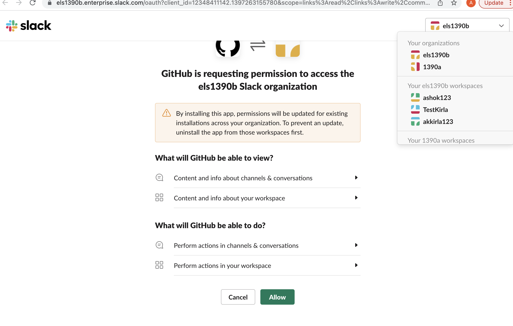

# GitHub + Slack Integration

| :warning: IMPORTANT          |
|:---------------------------|
| This repository is not accepting any code contributions. The current code which is running for GitHub and Slack integration has significantly diverged from the code present in this repository as it contains specific code which is required to run service in GitHub infrastructure and which can not be open sourced at this point of time. **We will continue to use issues in this repository to get feedback from customers**.|

> **Heads Up!** The GitHub and Slack app has a few new features to help you turn conversations into next steps. Take action on pull requests, issues, and more right from your Slack channels to start moving work forward, faster. [Read more about it on the GitHub blog](https://blog.github.com/2018-05-17-new-improvements-to-slack-and-github-integration/).

## About

The GitHub integration for Slack gives you and your teams full visibility into your GitHub projects right in Slack channels, where you can generate ideas, triage issues and collaborate with other teams to move projects forward. This integration is an open source project, built and maintained by GitHub.

## Table of Contents
- [Installing the GitHub integration for Slack](#installing-the-github-integration-for-slack)
  - [Requirements](#requirements)
  - [Installation](#installation)
- [Getting Started](#getting-started)
  - [Subscribing and Unsubscribing](#subscribing-and-unsubscribing)
  - [Authorization](#authorization)
- [Features](#features)
  - [Subscribe to an Organization or a Repository](#subscribe-to-an-organization-or-a-repository)
  - [Customize your notifications](#customize-your-notifications)
  - [Deployments and Actions approval notifications](#deployments-and-actions-approval-notifications)
  - [Mentions](#mentions)
  - [Take action](#take-action)
  - [Link previews](#link-previews)
  - [Scheduled Reminders](#scheduled-reminders)
  - [Enterprise Grid](#enterprise-grid)
- [Need help?](#questions-need-help)
- [License](#license)
--------
## Installing the GitHub integration for Slack
### Requirements
This app officially supports GitHub.com (which includes our GitHub Enterprise cloud-hosted offering) and Slack.com, but the team plans to support GitHub Enterprise Server (our self-hosted product) in the future.

### Installation
[Install the GitHub integration for Slack](https://slack.com/apps/A01BP7R4KNY-github). After you've signed in to your Slack workspace, you will be prompted to give the app access:

<p align="center"></p>

After the app is installed, and once you've added the GitHub integration to the relevant channels using `/invite @github`, you will see previews of links to GitHub issues, pull-requests, and code rendered as rich text in your workspace.

<p align="center"></p>

## Getting Started
Once you install the app, you can not interact with GitHub app as a Personal app or access from a channel. Once the app is installed in the workspace, the GitHub app is enabled in all the public channels. For private channels, you need to explicitly invite `/invite @github`

At this point, your Slack and GitHub user accounts are not linked. You will be prompted to connect to GitHub. This is a primary step required to access the app. Alternatively, we can also connect by running `/github signin`.

<p align="center"></p>

And once you connect, you will see the next steps and list of functionalities available for you. 
<p align="center"></p>


### Subscribing and Unsubscribing

The `/github` slash command also accepts a `subscribe` argument that you can use to subscribe to an Organization or Repository's activity `/github subscribe <organization>/<repository>`.

<p align="center"></p>

If you originally gave the app access to "All repositories" and you've created a new private repository on GitHub after installing the GitHub integration for Slack, the `/github subscribe` command will work automatically on your new repository. If you installed the app on a subset of repositories, the app will prompt you to install it on the new repository.

The `/github` slash command also supports `unsubscribe`. To unsubscribe to notifications from a repository, use `/github unsubscribe <organization>/<repository>`

### Authorization
By granting the app access, you are providing the following authorizations to your GitHub and Slack accounts:

#### Slack Permission Scopes

|Permission scope|Why we need it|
|---|---|
|Access private conversations between you and the App | To message you with instructions.  |
|View links to GitHub.com in messages| To render rich links from `github.com`|
|Add link previews to GitHub.com to messages| To render rich links to `github.com`|
|Add slash commands| To add the `/github` slash command to your Slack workspace |
|View the workspace or organization's name, email domain, and icon| To store subscriptions you set up|
|Post messages as the app| To notify you of activity that happens on GitHub, in Slack|

#### GitHub Permission Scopes

|Permission scope|Why we need it|
|---|---|
|Read access to code| To render code snippets in Slack|
|Read access to commit statuses, checks, discussions, issues, metadata, pull requests, and repository projects | To render previews of links shared in Slack|
|Write access to issues, deployments, and pull requests | To take action from Slack with the `/github` command and directly from messages|

## Features

### Subscribe to an Organization or a Repository
On repositories, the app notifies of `open`, `close`, and `re-open` events on pull requests and issues in repositories you've subscribed to. It also notifies of any `push` directly to the repository's default branch as well as `comments` on issues and pull requests.

### Customize your notifications

You can customize your notifications by subscribing to activity that is relevant to your Slack channel, and unsubscribing from activity that is less helpful to your project.

Settings are configured with the `/github` slash command:

```
/github subscribe owner/repo [feature]
/github unsubscribe owner/repo [feature]
```

These are enabled by default, and can be disabled with the `/github unsubscribe owner/repo [feature]` command:

- `issues` - Opened or closed issues
- `pulls` - New or merged pull requests, as well as draft pull requests marked "Ready for Review"
- `commits` - New commits on the default branch (usually `main`)
- `releases` - Published releases
- `deployments` - Deployment review notifications and Deployment status updates.

These are disabled by default, and can be enabled with the `/github subscribe owner/repo [feature]` command:

- `reviews` - Pull request reviews
- `comments` - New comments on issues and pull requests
- `branches` - Created or deleted branches
- `commits:*` - All commits pushed to any branch
- `+label:"your label"` - Filter issues, pull-requests and comments based on their labels.
- `discussions` - Discussions created or answered

You can subscribe or unsubscribe from multiple settings at once. For example, to turn on activity for pull request reviews and comments:

```
/github subscribe owner/repo reviews comments
```

And to turn it back off:

```
/github unsubscribe owner/repo reviews comments
```

#### Branch filters for commit
Branch filters allow filtering commit notifications. By default when you subscribe for commits feature, you will get notifications for your default branch (i.e. main). However, you can choose to filter on a specific branch, or a pattern of branches or all branches.

- `/github subscribe org/repo commits`  for commit notifications from a default branch.
- `/github subscribe org/repo commits:*`  for commit notifications across all the branches.
- `/github subscribe org/repo commits:myBranch`  for commit notifications from a specific branch.
- `/github subscribe org/repo commits:users/*`  for commit notifications from a pattern of branches.

You can unsubscribe commits feature using `@github unsubscribe org/repo commits.

*Note*: Previously we you might have used `commits:all` to represent all branches. 'all' is no longer a reserved keyword. Going forward, you need to use '*' to represent all branches. If you have already configured with 'commits:all' previosly, dont worry, it will continue to work until you update the commits configuration.


#### Label filters for prs and issues
Label filters allow filtering incoming events based on a whitelist of **required** labels.

This is an overview of the event types that are affected by the required-label filter.

| Event                  | Is filtered       |
| ---------------------- | ----------------- |
| Pull                   | ✅ Yes             |
| Comment (PR and Issue) | ✅ Yes             |
| Issue                  | ✅ Yes             |
| Review                 | ✅ Yes             |
| Commit/Push            | ❌ No              |
| Branch                 | ❌ No              |

##### Creating a filter

Create a filter with:
```
/github subscribe owner/repo +label:priority:HIGH
```

This creates a required-label filter with the value `priority:HIGH`.
Incoming events that support filters are discarded unless they have that label.

##### Updating a filter

To update the existing filter just enter a new one, the old one will be updated.
Currently, we only support having one filter. Multiple filters might be supported in the future.

```
/github subscribe owner/repo +label:"teams/designers"
```

Now the existing filter `priority:HIGH` has been replaced by `teams/designers`.

##### Removing filters

Removing a filter is available via `unsubscribe`
```
/github unsubscribe owner/repo +label:teams/designers
```

This removes the `teams/designers` filter.

##### Listing filters

To see the currently active filters use
```
/github subscribe list features
```

##### Valid filters

It is common to have certain special characters in labels. Therefore we added support for the most common special characters
for label filters. Here a few examples:

* `label:priority:HIGH`
* `label:teams/designers`
* `label:"DO NOT MERGE"`
* `label:"very important"`
* `label:":construction: WIP"`

Most labels will work seamlessly, this includes all emojis that slack and github provide out of the box.
However in the following rare circumstances you might run into difficulties:

* Multibyte characters that are not encoded as `:foo:`
* `,` is reserved

### Deployments and Actions approval notifications
Deployment review notifications for your GitHub Actions environments can now be tracked end-to-end from your channel or personal app in Slack.
You will be notified when a review is pending on your environment, when an approval is completed and you can see the real time status of your deployment.

These notifications are available as part for "deployments" feature which is enabled by default when you subscribe to your repository or organization.

The following are the notifications available as part of "deployments" feature:
1. Deployment review pending notifications for your environments being deployed through GitHub Actions workflow.
<p align="left"></p>

2. Deployment review completed notifications for your environments being deployed through GitHub Actions workflow.
<p align="left"></p>

3. Deployment status notifications for your environments. And the notification shows workflow information if the environment is deployed from GitHub Action workflow.
<p align="left"></p>


### Mentions
When you subscribe to a repository in Slack, you will now see yourself mentioned in the notifications where you are referred and needs your attention.
<p align="left"></p>
<p align="left"></p>

When you receive notifications for Issues, PRs and Deployments, here are the cases when you will be mentioned.
- Assignee in an Issue
- Reviewer for a PR
- Mentioned in a PR/Issue description/comment/discussion
- Reviewer for a Deployment
- Scheduled reminders for PR review requests

And the best part is - you can now see the summary of GitHub notifications where you are mentioned as part of 'Mentions & reactions' section in Slack.
<p align="left"></p>


#### How does mentions work?
Mentions will work only if you login to GitHub app in your Slack workspace. When you login to GitHub app with your GitHub id, we map it with your Slack id and ping you in Slack whenever you are mentioned in any of the GitHub notifications.  

**Note**: If you have multiple Slack workspaces where you use GitHub app, mentions will work only the workspace where you login to GitHub app the latest.  


### Take action

Slack conversations often lead to decisions and actionable takeaways. Now it’s easier to start on next steps from Slack with slash commands for common GitHub actions, using  `/github [action] [resource]`. These commands let you:

- Close an issue or pull request with `/github close [issue link]`
- Reopen an issue or pull request with `/github open [pull request link]`
- Open a new issue with `/github open [owner/repo]`


#### Link previews
<!-- preserve old anchor in case other docs link there -->
<a name="types-of-public-link-unfurls"></a>

When a user posts a GitHub link to **issues and pull requests**, directly linked **comments**, code **blobs** with line numbers, as well as **organizations, repositories, and users** in Slack, a preview of the link will be shown.

Previews of links will not be shown if:

- link previews for `github.com` have been [disabled for your workspace](https://get.slack.help/hc/en-us/articles/204399343-Share-links-in-Slack#turn-off-link-previews-for-specific-sites)
- the same link was already shared in the last 30 minutes in the same channel
- 3 or more links are shared in the same chat message
- The repository is private and the user that shared the link:
  - has not signed in to their GitHub account
  - asked not to show a preview when prompted
  - the GitHub app is not in the channel, which you can remedy with `/invite @github`


### Scheduled reminders
Scheduled reminders are used to make sure that users focus on the most important review requests that require their attention. Scheduled reminders for pull requests will send a message to you in Slack with open pull requests needing your review at a specified time. For example, you can setup scheduled reminders to send you a message in Slack every morning at 10 AM with pull requests needing to be reviewed by you or one of your teams.

You can configure scheduled reminders for you (personal reminders), your team and for your organization. 

#### Personal scheduled reminders
Personal scheduled reminders are configured as part of your GitHub personal app in Slack. You can set scheduled reminders for personal or team-level review requests for pull requests in organizations you are a member of. As part of personal reminders, you can also configure real time alerts for your pull requests. You can find more details [here](https://docs.github.com/en/account-and-profile/setting-up-and-managing-your-github-user-account/managing-your-membership-in-organizations/managing-your-scheduled-reminders).

#### Channel level scheduled reminders
You can configure scheduled reminders for pending pull requests as part of your Slack channels so that your team can stay on top of your work. For a given Slack channel, you can configure scheduled reminders for your organization or your team. For more details about configuring scheduled reminders, you should visit, [organization level reminders](https://docs.github.com/en/organizations/managing-organization-settings/managing-scheduled-reminders-for-your-organization) and [team level reminders](https://docs.github.com/en/organizations/organizing-members-into-teams/managing-scheduled-reminders-for-your-team). 

### Enterprise Grid
If you are on Slack Enterprise Grid and have multiple Slack workspaces in your organization where you need to use GitHub, you can install and manage your GitHub app on Slack Enterprise Grid. Org owners and Org admins in Slack Enterprise grid can:

1. Install the GitHub app at the org level and choose which workspaces you want to add/remove the GitHub app
<p align="left"></p>

2. Manage GitHub app installations requests from your workspace members.

3. Make GitHub app available in all future workspaces by default.
<p align="left"></p>

#### Few things to note
- Only Enterprise grid org admins and org owners will be able to install and manage the GitHub app at the grid level. 

- You can install the GitHub app at orglevel by clicking [here](www.slack.github.com) and selecting the enterprise grid organization to install. 
<p align="left"></p>

- If you have already installed GitHub app in one of the workspaces in the grid, you can now install the app at org level and manage it across the workspaces by going to your enterprise grid management console -> installed apps.
<p align="left"></p>

## Questions? Need help?
If you have any questions or concerns, please reach out to us by logging an issue [here](https://github.com/integrations/slack/issues/new/choose). Or please fill out GitHub's [Support form](https://github.com/contact?form%5Bsubject%5D=Re:+GitHub%2BSlack+Integration) and your request will be routed to the right team at GitHub.

## License
The project is available as open source under the terms of the [MIT License](LICENSE).

When using the GitHub logos, be sure to follow the [GitHub logo guidelines](https://github.com/logos).
